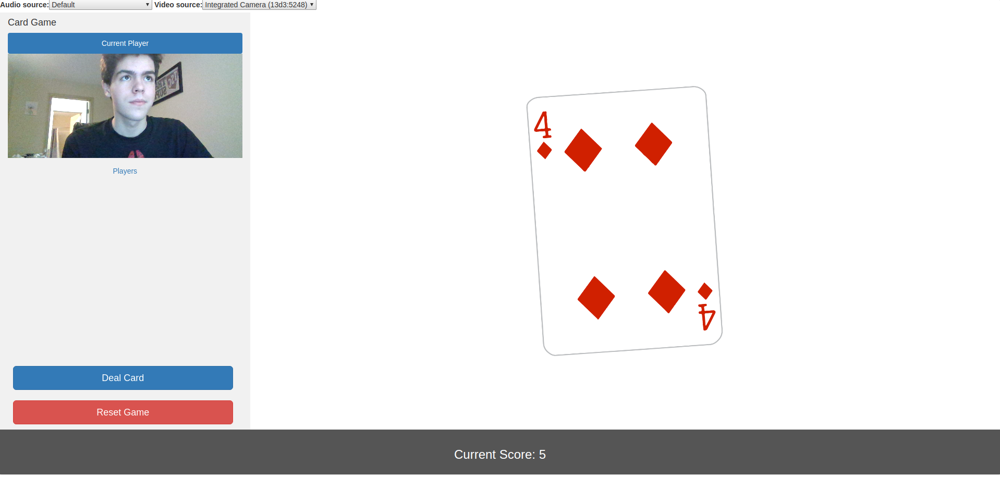
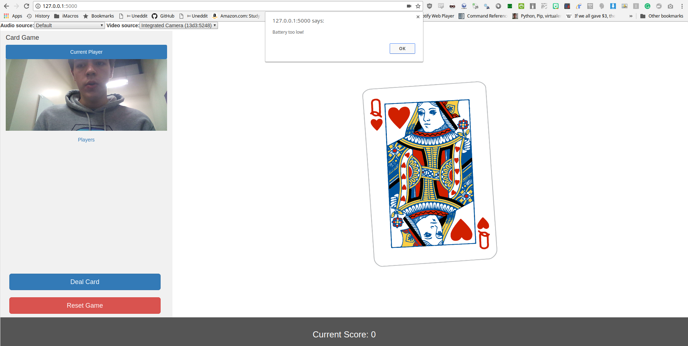
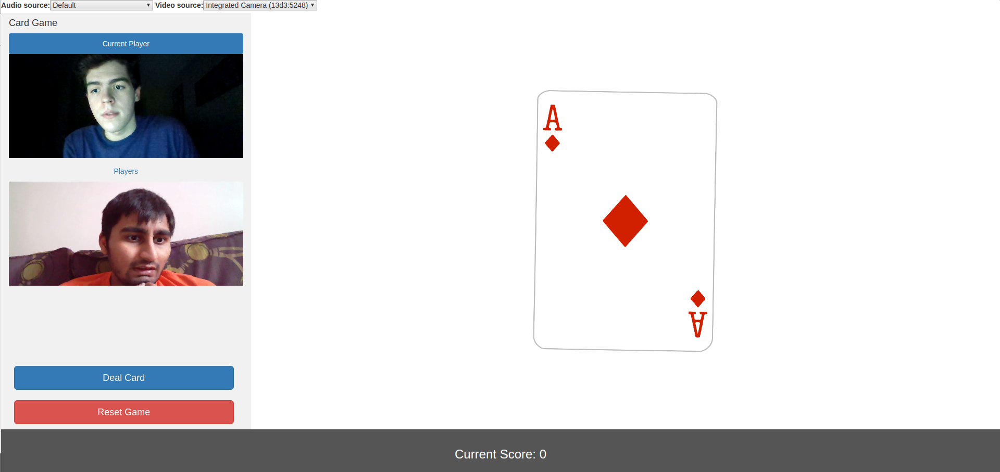

# Card Count
Project for the Agora Hackathon

<h1 align="center"><a href="https://agoradevpost.herokuapp.com/">Link to the Web App</a></h1>

## Objective

Card Count is similar to the children's game "Slapjack", with a few notable differences.  Rather than looking for Jack cards, the players look for "Key Pairs", which are defined as

- Cards with the same number (ie 4 of Hearts, 4 of Spades)

- Incrementing Cards (ie 4 of Hearts, 5 of spades)

The objective of the game is to audibly call out whenever a key pair is dealt on the screen.  The first player to call out the key pair will receive a point.

## How it's made

Using the agora.io SDK, I quantify large disrecapancies in audio volume to detect when a player has yelled "Slap" or called out a key pair.  Additionally, a group video call is made with each player on the site and any new players will be added to the existing video call.

To ensure that a player's laptop computer does not die while the game is in progress, I use the Agora SDK to get current battery percentage and alert players to leave the game between turns if they are below a certain battery threshold.

## UI

  

  

  <b>Play with friends</b>

